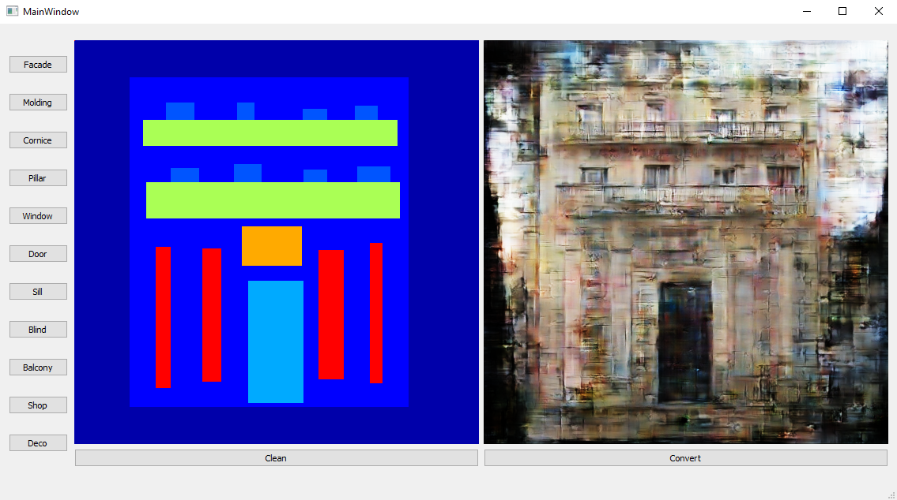

# House-Generator-w-Pix2PixGAN-PyQt5
 

If you want to try on your pc, you need to download weight from drive https://drive.google.com/file/d/11Dz6j3oN7cYDIllgy0Yb9BAI-x8zr9BO/view

Or if you want train your own Pix2Pix model https://github.com/cakiryusuff/Pix2Pix-GAN-Pytorch
